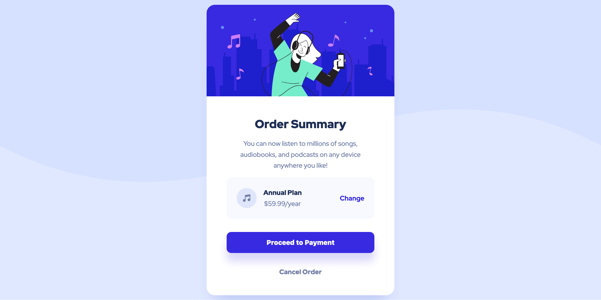

# Frontend Mentor - Order summary card solution

This is a solution to the [Order summary card challenge on Frontend Mentor](https://www.frontendmentor.io/challenges/order-summary-component-QlPmajDUj). Frontend Mentor challenges help you improve your coding skills by building realistic projects.

## Table of contents

- [Overview](#overview)
  - [The challenge](#the-challenge)
  - [Screenshot](#screenshot)
  - [Links](#links)
- [My process](#my-process)
  - [Built with](#built-with)
  - [What I learned](#what-i-learned)
  - [Continued development](#continued-development)
  - [AI Collaboration](#ai-collaboration)
- [Author](#author)

## Overview

### The challenge

Users should be able to:

- See hover states for interactive elements

### Screenshot

### Links

- Solution URL: [Add solution URL here](https://github.com/Kristina2025/FM7-Order-Summary-Component-Main)
- Live Site URL: [Add live site URL here](https://fm7-order-summary-component-main.netlify.app/)

## My process

### Built with

- Semantic HTML5 markup
- CSS custom properties
- Flexbox
- Mobile-first workflow

### What I learned

This project was mostly about practicing what I've learned so far.

### Continued development

I need to work more on building responsive sites and on accessibility.

### AI Collaboration

I didn't use AI for the building of this project.

## Author

- Frontend Mentor - [@yourusername](https://www.frontendmentor.io/profile/Kristina2025)
